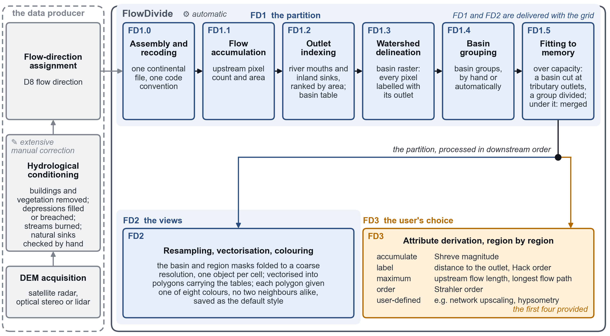
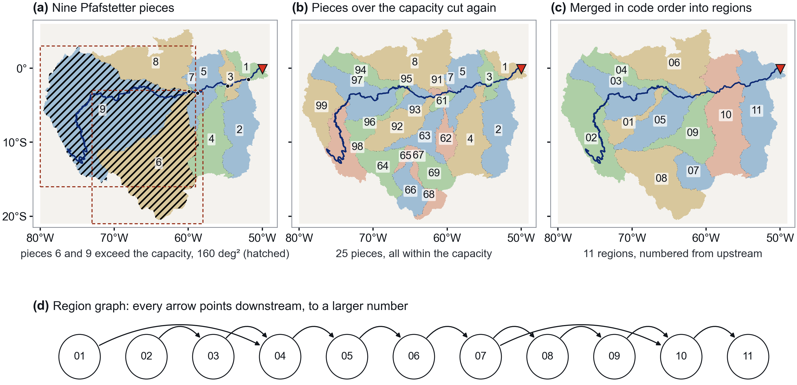

# FlowDivide

Hydrographic attributes from flow-direction grids too large for a computer's memory.

FlowDivide cuts a D8 grid into regions that fit a memory capacity you choose. The cuts follow the rivers:
whole basins are grouped, and a basin that is too large is cut at its tributary outlets (Pfafstetter). Each
region is then computed once, upstream to downstream, and one value crosses each cut. The results are exact:
the same, pixel for pixel, as a run on the whole grid in one array.

Tested on three large grids, all on one laptop with 64 GB of memory: HydroSHEDS v2 at 1 arc-second (30 m) over
South America (259,200 × 219,600 pixels) and over North America (277,200 × 424,800), and MERIT Hydro at
3 arc-seconds (90 m) over the whole globe (174,000 × 432,000).

*The workflow. FD1 makes the partition, FD2 the coarse views and polygons, FD3 the attributes region by region.*

*The Amazon at a capacity of 160 deg² (2³¹ pixels at 1 arc-second): cut into Pfafstetter pieces, the pieces
too large cut again, then merged into 11 regions numbered so that every flow goes to a larger number.*

## Install

    conda create -n flowdivide -c conda-forge python=3.11 numpy numba rasterio gdal pandas geopandas pyogrio pyarrow shapely scipy matplotlib
    conda activate flowdivide

## Run

The three grids of the paper are built in: HydroSHEDS v2 at 1 arc-second (South America, North America) and
MERIT Hydro at 3 arc-seconds (global). Download the inputs from their producers
([`DATA_NOTICE.md`](DATA_NOTICE.md)) and point the package at them with environment variables
(see the [user guide](docs/user-guide.md#running)). Then

    python flowdivide.py run south-america --out-root /data/flowdivide
    python flowdivide.py run south-america --out-root /data/flowdivide --steps fd3 --capacity 2^31

Any other flow-direction grid, in any coding, projection or resolution:

    python flowdivide.py run mygrid --dir /data/mygrid_dir.tif --convention esri --out-root /data/flowdivide

Out come the partition at three capacities (2³¹, 2³⁰, 2²⁹ pixels), the basin and region tables, the coarse views
as rasters and GeoParquet polygons, and six attributes: Shreve magnitude, distance to the outlet, Hack order,
upstream flow length, longest flow path and Strahler order. You can add your own attribute as a Numba kernel.

Every step checks its own output, and a stopped run resumes where it stopped.

## Documentation

- [User guide](docs/user-guide.md): all options, the output files, the checks, adding an attribute
- Products and the other FullHydro tools: <https://fullhydro.org/tools/>

## Tests

    python test_region_numbering.py

Five tests need no data; the rest run on a basin cut from a finished run
(see the [user guide](docs/user-guide.md#tests)).

## Acknowledgements

MERIT Hydro (Yamazaki et al., 2019; [10.1029/2019WR024873](https://doi.org/10.1029/2019WR024873)), HydroSHEDS v2
and HydroBASINS (Lehner and Grill, 2013; [10.1002/hyp.9740](https://doi.org/10.1002/hyp.9740)).

## Licence

MIT; see [`LICENSE`](LICENSE). The data FlowDivide runs on keep their producers' terms; see
[`DATA_NOTICE.md`](DATA_NOTICE.md).

Author: Lulu Jiang (<https://lulujiang.me>) · <lulu_jiang@pku.edu.cn>
