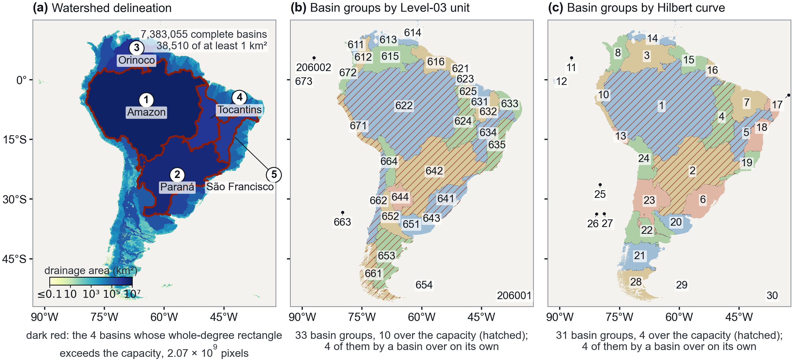

# FlowDivide user guide

The full reference for the Python package: every option, every output file, the rules, and
the checks. The short introduction is the [README](../README.md).

## The files

The package follows the three stages of the paper step by step: the same rules, the same numbering, the same
directory layout, the same file names and table columns as the published products.

| file | what it does |
|---|---|
| `flowdivide.py` | the datasets, the chain (markers, timing, the keep option), the command line |
| `fd1_partition.py` | stage 1, the partition: FD1.0 recoding, FD1.1 accumulation, FD1.2 outlets, FD1.3 delineation, FD1.4 grouping (by Level-03 unit, and automatically along a Hilbert curve), FD1.5 fitting to memory |
| `fd2_views.py` | stage 2, the views: resampling, vectorisation, colouring, the Level-02 tables; and Figures 3, 4 and 5 of the paper |
| `fd3_attributes.py` | stage 3, the attributes region by region: Shreve, distance to outlet, Hack, upstream flow length, longest flow path, Strahler, and a rule of your own |
| `fd_tables.py` | the tables: one writer and one reader for each |
| `tile_kernels.py`, `test_tile_kernels.py` | the same four kernels on the tiles the data are distributed in, one tile at a time (see below) |
| `three_ways.py`, `test_three_ways_on_one_basin.py` | the check: the same attribute over the whole grid, on HydroSHEDS' 10° tiles, and on the published cut, compared pixel for pixel (see below) |

## Requirements

Python 3.10 or later with `numpy`, `numba`, `rasterio`, GDAL's own Python bindings (`osgeo`; fd1.4 burns the
Level-03 polygons with them), `pandas`, `geopandas`, `pyogrio`, `pyarrow`, `shapely`, `scipy`,
`matplotlib`. A conda environment with GDAL is the easy way:

    conda create -n flowdivide -c conda-forge python=3.11 numpy numba rasterio gdal pandas geopandas pyogrio pyarrow shapely scipy matplotlib
    conda activate flowdivide

## Running

Three grids are built in, the three of the paper: HydroSHEDS v2 at 1 arc-second over South America
and over North America, and MERIT Hydro at 3 arc-seconds over the whole globe. The inputs are not part
of this repository; download them from their producers and use them under their terms
([`DATA_NOTICE.md`](../DATA_NOTICE.md)). Point the package at your copies with environment variables:

    export FLOWDIVIDE_HYDROSHEDS=/data/hydrosheds_v2               # <continent>_DIR_1s_v2r0.tif, _ACC_ and _ACA_ beside it
    export FLOWDIVIDE_MERIT=/data/merit/dir_global_90m.tif
    export FLOWDIVIDE_MERIT_ACC=/data/merit/upg_global_90m.tif     # MERIT Hydro's upstream pixel count
    export FLOWDIVIDE_MERIT_ACA=/data/merit/upa_global_90m.tif     # MERIT Hydro's upstream area
    export FLOWDIVIDE_MERIT_BASIN_IDS=/data/merit/outlets.csv      # the outlet table of MERIT BasinFull, whose basin ids a re-run carries over
    export FLOWDIVIDE_HYBAS=/data/hybas/L3                         # hybas_<xx>_lev03_v1c.shp (or --hybas-root)

There are no default paths: a run of a built-in grid whose inputs are not set stops and names the
variables that are missing. FD1 reads all of them, FD3 reads the upstream area as well when it computes
the Hack order (`hck`, one of the default attributes), and any other run needs only the flow directions. Then

    python flowdivide.py run south-america --out-root /data/flowdivide
    python flowdivide.py run north-america --out-root /data/flowdivide
    python flowdivide.py run merit-global  --out-root /data/flowdivide

Each run makes the partition at three capacities (2³¹, 2³⁰ and 2²⁹ pixels, realised as 160, 80 and 40
whole degrees at 1 arc-second and as 1,400, 700 and 350 at 3 arc-seconds), the views, and, for the
two 30 m grids, the figures. The attributes are a separate step on one capacity:

    python flowdivide.py run south-america --out-root /data/flowdivide --steps fd3 --attributes shv,ldn,hck,lup,lfp,ord --capacity 2^31

FD3 holds one region's window at a time. The output blocks that two regions share wait for the second region in
memory up to 512 MB (`FLOWDIVIDE_HELD_MEMORY_MB` sets another budget) and on disk beyond it, beside the output raster
(`<raster>.held_blocks/`, removed when the step ends; on North America at 2^30 up to about 12 GB). Every region line
of the log gives the peak memory so far.

The HydroSHEDS ACC mosaic of a built-in grid can be replaced by a count made from the flow directions
(`--acc`); the upstream area stays the provider's.

## Any baseline hydrography

Any flow-direction grid runs the same way, at any resolution, projected or geographic, in any coding:

    python flowdivide.py run mygrid --dir /data/mygrid_dir.tif --convention merit --group-vectors /data/basins.shp \
        --capacities 2^31:3,2^30:3 --out-root /data/flowdivide

| what differs between producers | how it is given |
|---|---|
| the eight direction codes | `--convention merit` / `esri` (1 E, 2 SE … 128 NE), `hydrosheds` (the same codes, 0 an inland sink, 255 no data), `taudem` (1 E, then counter-clockwise), `grass` (1 NE … 8 E), `degrees` (45 NE … 360 E), or `custom --direction-codes E=1,SE=2,S=4,SW=8,W=16,NW=32,N=64,NE=128` |
| the value of an inland sink, of no data, of a river mouth | `--sink-code`, `--nodata-code`, `--mouth-code`, where they differ from the convention's own; without a mouth code a direction pointing into no data or off the grid is the mouth |
| the raster type | any integer raster (the degrees do not fit a byte, and GRASS writes a CELL raster) |
| the resolution and the projection | read from the grid; a geographic grid's blocks are one degree, a projected grid's about 100 km, and `--block` sets another |
| the basin groups | `--group-vectors <polygons>` (repeat for several; `:<pandas query>` filters one), any file whose units are whole basins; without it the basins are grouped along a Hilbert curve (`--groups hilbert`) |
| the views | named by their cell size on a grid this package has no fixed names for: 100 m, 500 m, 2.5 km on a 10 m grid; 10 s, 50 s, 240 s on a 1 arc-second grid |

[](media/basin_groups_south_america.png)

*South America, HydroSHEDS v2 at 1 arc-second: (a) the basins, (b) grouped by HydroBASINS Level-03 unit, (c) grouped automatically along a Hilbert curve; hatched, the groups over a capacity of 2³¹ pixels.*

FD1.0 is the only step that reads the producer's coding: it writes the grid in one coding (1 E … 128 NE,
0 a river mouth, 255 an inland sink, 247 no data) and every later step reads only that.

`--convention hydrosheds` for a grid in the HydroSHEDS v2 convention (0 inland sink, 255 nodata, a
coastal outlet keeps its direction code), `merit` for one already in the MERIT convention (0 river
mouth, 255 inland sink, 247 nodata). `--dir` may be one file or a directory of tiles, which are
assembled first. `--periodic` for a grid that spans 360 degrees of longitude. A capacity is named by
a power of two (realised as the round number of whole blocks below it) or by a
number of blocks (`160deg2`), each followed by the depth of the Pfafstetter cut at that capacity.
Without `--l3` the basins are grouped automatically along a Hilbert curve and the partition follows
those groups. With `--acc` and `--aca` (a provider's upstream count and area on the same grid,
`--aca-unit km2|m2`) fd1.1 is not run and only the channel mask is made from the area. A channel
(river) pixel has at least 1 km2 upstream on the two HydroSHEDS grids and on a grid of your own, and at
least 10 km2 on MERIT; `--channel-threshold-km2` sets another. The
threshold is put into the raster's unit and into float32 once and compared with the float32 area,
and a value of 3e38 or more is not a channel.

Every run begins by printing what it reads, decides and writes — the command, the inputs with their
paths or `none`, the options in effect, every product with its resolution (`1/3600° (30 m)`,
`1/1200° (90 m)`, the views at `1/400° (280 m)`), its path and whether it is kept or dropped — and
saves it as `_logs/run_summary_<dataset>.txt`. `--summary-only` prints that page and the plan and
runs nothing.

`python flowdivide.py run --help` lists every option under five headings: what to run, the partition
(`--groups l3|hilbert`, `--levels`), the keep option (`--drop`), the views and the figures
(`--vector geoparquet|gpkg|both`, `--colours`), a grid of your own (`--island-reach`, `--island-max`
for the island rule).

Every step leaves a marker with a signature of its arguments and of the steps it depends on, so a run
that stopped is taken up where it stopped, an identical run does nothing, and a changed parameter (the
channel threshold, the merge policy, a capacity) reruns the step and everything after it. The signature
carries the version of the rules that make the results (`RULES_VERSION`), not the package version, so
a release that changes wording or timing reruns nothing. An input from outside the run's tree (a
provider's mosaic, the Level-03 vectors) enters every step's signature with its size and modification
time: a step whose outside input has changed since it ran is refused, and an output that is empty or
has lost the `.done` marker it had is made again. Each step runs in a child process of its own,
so that its wall time and its peak memory go to the marker and to `_logs/chain_summary.txt`
(`--in-process` keeps everything in one process). With `--timing on` (the default) the time of every
step is split into input (reading the rasters and tables, the decompression), compute, and output
(writing them, the compression and the flush at close), with the step's own read-back checks apart;
the split goes to the marker and to `_logs/timings_<dataset>.csv` (`work_seconds` is the time without
the checks). `--timing off` records the total only. Before a step starts, the free disk is set against
what the step adds.

## The keep option

Two ways of saying which of the intermediates stay on disk: `--keep bsn,rgn,pieces` keeps those and
deletes every other one as soon as the last step that reads it is done, and `--drop acc,aca,str` says the
same thing the other way round. The recoded flow directions, the tables and the polygon files are always
kept.

Every raster written to disk is a variable that can be dropped with `--drop`; a dropped variable is
deleted as soon as the last step of the run that reads it is done, and made again if a later run
needs it.

| variable | file | what | read by |
|---|---|---|---|
| `dir` | `dir_<c>_<tag>_merit.tif` | the recoded flow directions | everything (never dropped) |
| `acc` | `upg_<c>_<tag>.tif` | upstream pixel count | fd1.2, fd1.5 (the cut) |
| `aca` | `upa_<c>_<tag>.tif` | upstream area, m² | fd1.2, fd1.5 (the areas of the pieces), fd3 hck |
| `str` | `str_<c>_<tag>.tif` | channel mask (upstream area ≥ 1 km², 10 km² on MERIT) | fd1.5 (the cut), fd3 shv hck ord |
| `l3` | `l3_<c>_<tag>.tif` | the Level-03 codes burned onto the grid | fd1.4 |
| `bsn` | `bsn_<c>_<tag>.tif` | the basin of every pixel | fd1.4, fd1.5, fd2, figures |
| `rgn` | `rgn_<c>_<tag>.tif` | the region of every pixel | fd2, figures |
| `pieces` | `pfafstetter_pieces_<c>_basin<id>_<tag>.tif` | the piece rasters of the cut basins | fd1.5, fd2 (the piece view), figures |
| `shv ldn hck lup lfp ord` | `<var>_<c>_<tag>.tif` | the attributes (`shv` UInt32 nodata 0, `ldn` Float32 nodata −1, `hck` and `ord` Byte nodata 0, `lup` Float32 nodata −9999, `lfp` UInt32 nodata 0 — the C's values, so a raster of either program reads in the tools of the other) | products (lfp reads the member table of ldn) |

    python flowdivide.py run south-america --out-root /data/flowdivide --drop l3,acc,aca

## What comes out

Under `<out-root>/<dataset>/` (`<c>` the continent,
`global` for the MERIT grid; `<tag>` the resolution, `1s` or `3s`):

- `global/fineresolution/{dir,upg,upa,str,l3,bsn}/` — the continental rasters
- `global/table/` — `basin_table_fine_<c>.csv` (one table from fd1.2 on, one row per basin: outlet, count, area, rectangle from fd1.3, the groups from fd1.4, the columns of fd1.6 and fd1.7), `group_l3_fine_<c>.csv`, `group_l2_fine_<c>.csv` and `group_l1_fine_<c>.csv` (fd1.4; each basin's `level3_id`, `level2_id` and `level1_id` are columns of the basin table, there is no separate basin-to-group file for them), and for the automatic groups `group_hilbert_fine_<c>.csv` and `basin_group_hilbert_fine_<c>.csv`
- `global/coarseresolution/{bsn,grp}/` and `global/vector/` — the basin and group views at 400, 200, 120 and 20 cells to the degree (1/20° is the grid GloFAS v4 runs on), as rasters and as polygon files. The views are an upscaling: a view holds the basins of at least a quarter of a cell at the equator (0.0194, 0.0775, 0.2151 and 7.7450 km² at 1/400°, 1/200°, 1/120° and 1/20°), and since the basins are numbered from the largest down those are the ids 1..N; a cell that is at least a quarter land goes to the largest of them — the smallest id — holding at least a quarter of its land; the region and group views follow the basin view of the same resolution (a cell with a basin lies in the region, or the group, of that basin; a cell without one takes the region or group holding most of it, the cell being a quarter land). Every view carries the rule in its metadata item `FLOWDIVIDE_VIEW_RULE`, and a basin view the area of its smallest basin as `FLOWDIVIDE_VIEW_MIN_BASIN_AREA_KM2`.
  The polygon files: one layer per view, the rows 1..N of the basin table (fid = basin_id, so one index, basin_id − 1, reaches a basin in the fine table and in every view) or every row of the region or group table (fid = row); a row whose object holds no cell at that resolution keeps its row with no geometry, 0 in `coarse_grid_count` and −9999 in the cell columns and `color_id`, never dropped in silence. A file carries few columns — the identifier, the size and the place of the object (`basin_id, basin_area_km2, outlet_lon, outlet_lat`; `region_id, cut_basin_id, topological_level, region_grid_count`; `group_id, group_level, group_kind, level_code, level3_count, basin_count, land_grid_count`) and what the view adds (`coarse_grid_count, cells_per_degree, cell_row_min, cell_row_max, cell_col_min, cell_col_max, color_id`); everything else is in the fine table at the row the identifier names. `--vector geoparquet` (the default) writes GeoParquet 1.1 (`.parquet`: ISO WKB, zstd, row groups of 65,536 rows, no `crs` entry so the coordinates are longitude and latitude on WGS84, OGC:CRS84; the file metadata carries the rule, the area, the resolution and what the rows are), `--vector gpkg` a GeoPackage, `--vector both` the two with the same rows and columns. The boundary files `bnd_` hold the outer rings of the basins drawn, with the identifier and the first two added columns, and carry their table row as the GeoPackage fid. A GeoPackage view carries a default style: a QGIS categorized fill on `color_id` in the file's `layer_styles` table, seven colours of Okabe and Ito's palette and a purple, then three reserves, so that QGIS colours the layer the moment it is opened; a GeoParquet file carries no style, and which hue a `color_id` number gets is then the map's choice
- `partitions/<capacity>/global/table/` — `region_fine_<c>.csv`, `piece_fine_<c>.csv`, `basin_region_<c>.csv`, `region_merges_<c>.csv`, `pfafstetter_pieces_<c>_basin<id>.csv`, and the attribute tables `shreve_basin_<c>.csv`, `distance_to_outlet_basin_<c>.csv`, `hack_basin_<c>.csv`, `lup_basin_<c>.csv`, `lfp_basin_<c>.csv`, `strahler_basin_<c>.csv`
- `partitions/<capacity>/global/{preview,fineresolution/<var>,coarseresolution/rgn,vector}/` — the piece rasters and the preview of the figure basin's pieces (one cell per 30 x 30 pixels, the corner pixel), the region mask and the attributes (rasters and tables), the region views (no member mask is written; the members are the rows of the tables)
- `figures/` — Figures 3, 4 and 5; `_logs/` — the markers, the summary, the timings

Every table is space separated with one header line.

Every rectangle in the tables is left closed and right open: `row_min` is the first row inside, `row_max`
the first row past it, so `nrow = row_max - row_min`, and a loop over the rows runs `row_min <= row < row_max`.
The same holds for the columns, for the `basin_*`, `bbox_*` and `cell_*` rectangles, and for the block
windows of the group tables (`window_row_max` is one past the last block).  A rectangle in degrees
follows from the pixel edges, so `maxlon` is the left edge of column `col_max`.

Every step checks itself: the recode counts add up and the file reads back as written; the counts
ending at the outlets equal the land pixels; every basin's pixel count equals the upstream count at
its outlet; every piece's count equals the upstream count at its outlet less what flows in from the
pieces above; every region window is within the capacity and the region graph has no cycle; every
region and every piece holds in the mask what its members say; the colouring is read back from the
file; the magnitude at every outlet equals the number of sources; the longest flow path measures
what the distance walk found. A check that fails stops the step and nothing is published under its
final name. The time of the read-back checks is recorded apart from the time of the work.

The inputs of a step are checked before anything is indexed with them:
flow directions in the MERIT coding are uint8 and hold only the eight directions, 0, 255 and 247; the
channel mask, the upstream area, the basin mask, the Level-03 raster, the views and the piece rasters
lie on the grid of the flow directions (size, origin, pixel size and CRS) and the masks are unsigned; a
basin id past the basin table stops the step; a cut basin has one piece that flows into no other, its
outlet and upstream area are the basin's, and every other piece flows into the parent inlet its row
gives.

## The rules, and what makes the output exact

The rules are those of the paper: the vote of every basin over the burned Level-03 raster, the code of
the longest shared boundary for a small doubtful basin, the nearest coded outlet within one block for
what is left, the islands gathered around seeds; the automatic grouping along a Hilbert curve with
its joins and cell moves; the Pfafstetter cut to a fixed depth per capacity (3, 3, 4 levels), the
used pieces the shallowest that fit; the regions numbered so that every flow goes to a larger number;
the Hack order by upstream area.

Every tie is broken by a written rule, so that the same input gives the same tables byte for byte. The
four largest tributaries of a walk are chosen by upstream count, then the one nearer the outlet, then
the tributary pixel first in the scan of a pixel's neighbours, row then column; back along the stem by
position, then the larger, then the scan. A longitude or latitude that prints as a negative zero is
printed as 0; `partition_config.txt` is one line (capacity_px, block_px, groups, index_bits); the joins
of merge=level2 are made in a fixed order, so that `region_merges` lists them in the same order with
the same windows; the six basin tables of FD3 are printed column by column (longitudes and latitudes
with seven decimals, areas with six), and on a projected grid they give the outlets and the heads in
longitude and latitude. The Level-03 polygons are burned with GDAL's RasterizeLayer on the whole output
(512 x 512 tiles, the layers in order); a filter GDAL does not accept, a layer without a spatial
reference, a code outside 100 to 999, any GDAL failure and a written file off DIR's grid stop the step.

The distance to the outlet and the upstream flow length cover every basin however small, while their
tables list the basins of 1 km2 and more; the small basins that lie whole in one region are kept as
arrays gathered by region and swept with the members of their region. The table of the longest flow
path gives the length the distance walk found, not the sum along the painted path (the two add in other
orders). The polygons of the views are GDAL's as Polygonize gives them from 4-connected cells, in its
order: two cells that meet only at a corner are two polygons of the MultiPolygon, which OGC allows, and
every polygon is checked for validity and for the area of its cells before it is written; the boundary
lines are the outer rings of the 8-connected polygons, a basin's outline as a map draws it. The colour
numbers (`color_id`) come from the smallest-last order taken with buckets, so they too are fixed. Every
vector file names its rule (`FLOWDIVIDE_VECTOR_RULE`).

Two things are added to the method of the paper: `--levels auto` lets the depth of the cut be decided by the
windows (a piece expected to hold more than half the capacity is cut before labelling, and what is
still over after labelling is cut again); and the channel mask `str` is written by fd1.1 so that the
area raster can be dropped early. The main stems of the cut are walked on the channel network of the
basin held in memory (about 49 bytes per channel pixel; the Amazon's 140 million channel pixels take
some 7 GB), and a stem with fewer than four channel tributaries — or whose fourth could be outranked
by a tributary below the threshold — is walked again over every pixel through a block cache; the pieces come out the same.

In stage 3, a block of the output raster that several regions' windows reach is held in memory, in the
raster's own type, until the last of those regions has been visited, and the arrays of a region's window
are released before the next window is read. The log of each region gives the blocks held in memory.

Known costs of this version: the per-basin arrays of the vote and of the views are dense (about 2.4 GB
for 30 million basins); the colouring visits the neighbours' neighbours of every polygon.

## The same kernels on regular tiles

`tile_kernels.py` computes four kernels on the tiles the data are distributed in (HydroSHEDS v2: 10° × 10°,
corners at whole multiples of ten degrees), **one tile at a time**: the upstream area, the distance to the
outlet, the longest upstream path with the pixel it starts at, and the Strahler order. It is what a program
does when it knows nothing about where the basins are, and it is the comparison the paper's Figure 7
makes with the partition of FD1.5.

    python tile_kernels.py dir_south-america_1s_merit.tif ldn ldn_tiles.tif --tile-degrees 10

The first three take two passes over the grid with an exit graph in between. The Strahler order cannot: an
order is not a sum, so an order arriving late at a tile changes the orders below it and the tile has to be
computed again; the tiles are swept until nothing changes and the number of sweeps is reported (11 sweeps
over the 6 one-degree tiles of basin 141 of South America, the basin the test uses). That is the cost a cut
which does not respect the basins pays, and the reason the partition of this package visits every region
once. The exits of the tiles must form a forest: a cycle through several tiles stops the Strahler order.

`test_tile_kernels.py` checks all four against a whole-domain computation, pixel for pixel, on a real basin,
and against the independent whole-domain answers of `three_ways.py`. On basin 141 of South America the four
tiled kernels equal the whole-domain answers on all 6,948,245 land pixels.

## Checking that a cut does not change the answer

`three_ways.py` computes the same attribute three ways on one basin, and
`test_three_ways_on_one_basin.py` runs all seven on a real basin and compares every pixel:

| way | what it is |
|---|---|
| `int64` | the whole rectangle in one array, every pixel addressed by a 64-bit index: no boundary at all, the reference |
| `square` | one part at a time, the parts the 10° × 10° tiles HydroSHEDS v2 is distributed in (corners at whole multiples of ten degrees, named by their south-west corner, e.g. `n40w080`) |
| `cut` | one part at a time, the parts the regions of FlowDivide's published partition at a chosen capacity |

The two by-part ways are the same code; only the part id per pixel differs. Seven variables: the
upstream pixel count and area, the Shreve magnitude, the distance to the outlet, the upstream flow
length (with its source pixel), the Strahler order and the Hack order. The lengths are whole
centimetres and the areas whole square metres, so every sum is exact and the comparison is plain
equality. When the parts cannot be ordered (a river leaves a tile and comes back), the Strahler
order sweeps the parts again until nothing changes, and the number of sweeps is reported.

    python test_three_ways_on_one_basin.py prepare /data/flowdivide south-america 7 40 /data/three_ways/basin7
    python test_three_ways_on_one_basin.py all /data/three_ways/basin7

The whole rectangle stays in memory whichever way runs, so the basin has to fit: about 29 bytes a
rectangle pixel for `int64` and 65 for a by-part way. Our check was made on basin 7 of South America,
the Parnaíba (349,598,006 land pixels, 749,344,500 in its rectangle), the largest basin a 64 GB laptop
can run all three ways on; the results are in `compare_python.txt` of the case directory. The production run of the package holds one region at a time
(`fd3_attributes.py`); these two files are for checking, not for producing.

## Tests

The tests are scripts; each prints its checks and leaves with exit status 0 when every check passes.

    python test_fd1_6_basin_table.py              # fd1.6 on a made-up table
    python test_region_numbering.py               # the numbering of the published regions
    python test_pixel_area_and_basin_ids.py       # pixel areas, carried-over basin ids
    python test_level_fold.py                     # the fold of the Level-03 groups to Level-02 and Level-01
    python test_color_id_style.py                 # the default style of a GeoPackage view
    python test_three_ways_on_one_basin.py all <case directory>
    python test_tile_kernels.py <case directory>
    python test_fd3_sweeps.py <case directory>

The first five need no data. `test_level_fold.py` also folds the Level-03 tables of a finished run
when `FLOWDIVIDE_DATA_ROOT` names the directory that holds them (`HydroSHEDS_v2_30m/<continent>/` and
`MERIT_Hydro_90m/global/`). Without it, that part is skipped. The last three run on a case
directory that `test_three_ways_on_one_basin.py prepare` cuts from a finished run; they write their
answers into it.

## Adding an attribute

Write a Numba kernel with the shape `derive_user_attribute` calls and register it:

```python
import fd3_attributes as fd3

@fd3.njit(cache=True)
def my_rule(order, downstream, member_of_pixel, dir_window, out_window, channel_window, area_window, lengths, ncol,
            visited_of_member):
    # order: the window's pixels, upstream first; downstream: the window pixel each flows into (-1 at an outlet or
    # off the window); member_of_pixel: the member each pixel belongs to (its index in the region's members; -1 for a
    # pixel that drains through a cut into another region)
    ...
    return 0          # a status: 0 when the sweep went through, any other value stops the run
```

```python
fd3.register_attribute("myr", "my attribute", "float32", -9999.0, downstream_first=False, channel=False, area=False, kernel=my_rule)
fd3.derive_user_attribute("myr", partition, dir_path, out_path, table_path)
```

The driver reads each region as one window, works out the visiting order, the pixel each flows into and the
member of every pixel (the child pieces in other regions not entered), calls the kernel once per region, and
writes the window back; the kernel writes into `out_window` and counts the pixels it gives a value, member by
member, into `visited_of_member`, which goes into the table.  The regions are visited in the order the rule
needs (`downstream_first=True` for a value handed up from the outlet).
